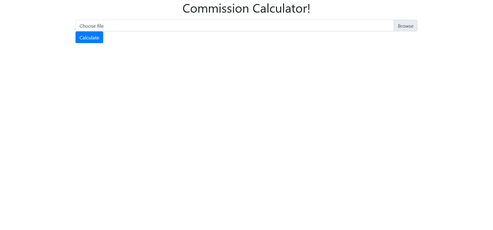

# Commission Calculator


## Installation
- Git clone the project repository from this link: [Commission Calculator](https://github.com/mah-shamim/Commission-Calculator.git)
- Execute this  command to install composer dependence
```bash
composer install
```
- Create an application Encryption Key using this command
```bash
php artisan key:generate
```

## Application Run
- To start the application run this command
```bash
php artisan serve --port=5005
```
- Click on this link: [Commission Calculator](http://127.0.0.1:5005) to open application

## Manual


## Interface



